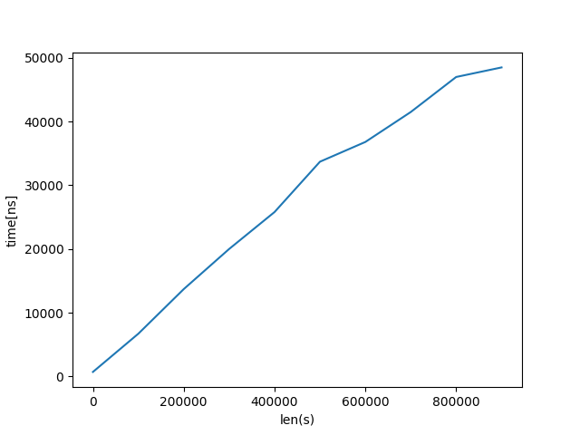

# Problem
https://leetcode.com/problems/first-unique-character-in-a-string/?envType=problem-list-v2&envId=2pon0nt6

# Step 1
とりあえずHashMap型として値を保持しておけば文字を参照するコストがO(1)で済むのでOKかなと思い、以下のコードを作成した。

```python

class Solution:
    def firstUniqChar(self, s: str) -> int:
         c_to_counts = dict()
         for idx, c in enumerate(s):
            if c not in c_to_counts:
                c_to_counts[c] = 1
            else:
                c_to_counts[c] += 1
        
        count_accum = 0
        for count in c_to_counts.values(): # 入った順番に出してくれるのだろうか？
            if count == 1:
                return count_accum
            count_accum += count
        return -1

```
しかしこのコードだと```loveleetcode```に対して```4```と回答した。  
正しくは```2```である。これはその通りで、
```python
{
    "l": 2,
    "o": 2,
    "v": 1,
    ...
}
```
として```c_to_counts```を保持しているのでそれをたどっていった際に```v```が```4```であると解答してしまう。


それで、保持する形式が冗長になってしまっているような気がするが以下のコードを作成
```python
class Solution:
    def firstUniqChar(self, s: str) -> int:
        c_to_counts_and_indexes = dict()
        for idx, c in enumerate(s):
            if c in c_to_counts_and_indexes:
                c_to_counts_and_indexes[c]["count"] += 1
                c_to_counts_and_indexes[c]["index"] = idx
            else:
                c_to_counts_and_indexes[c] = {"count": 1, "index": idx}
        
        for c_info in c_to_counts_and_indexes.values():
            if c_info["count"] == 1:
                return c_info["index"]
        return -1
```
これだと通った。  
しかしループが O(2 * len(s)) 程度回っている、かつ空間計算量もかなりかかっていそうな気がする。
ループを一回回すだけで求められたりしないのだろうか？
(まあ時間計算量という点ではループをどれくらい回るかというのは間接的な指標でしかなくて、  
もしループを一周回すだけでもその一つ一つが重い処理だったらそれは遅いよね)
 
# Step 2

まず自分の解答を作成している中で気になったのが、
```python
c_to_counts_and_indexes.values():
```
としているところで、dictクラスのvaluesメソッドを使用するとその中身がどのような順番で出てくるのかということである。
listクラスとかなら、listに追加された順番で出てくるような気がする。  
しかしdictクラスは？   


https://docs.python.org/ja/3.12/library/stdtypes.html#dict-views  
に書いてあることとして
> キーと値は挿入順序で反復されます。
とあるのでlistと同様に出力が得られるのだろう。

ただこの仕組みというか、dictがどのように実装されているのかが未だにわかっていないのがつらみ。  
- https://stackoverflow.com/questions/327311/how-are-pythons-built-in-dictionaries-implemented/44509302#44509302
- https://github.com/python/cpython/blob/main/Objects/dictobject.c
ここら辺が参考になる気がする。

## Leetcodeの解答 1
```python
class Solution:
    def firstUniqChar(self, s: str) -> int:
        """
        :type s: str
        :rtype: int
        """
        # build hash map: character and how often it appears
        count = collections.Counter(s)
        
        # find the index
        for idx, ch in enumerate(s):
            if count[ch] == 1:
                return idx     
        return -1
```
これは```collections.Counter()```を使用していた。  
dict()を継承したサブクラスであり、初期化の際にiterableなオブジェクトも引数にとることができる。
https://docs.python.org/ja/3.12/library/collections.html#collections.Counter
```python
c = collections.Counter("gallahad")
```
とすると、その引数として与えられた文字列をカウントするらしい。  

ただこの構造を使用しても初見の人はどのような動作をするのかがわからないため、一端は使用を避けるか？

## Leetcodeの回答 2
https://leetcode.com/problems/first-unique-character-in-a-string/?envType=problem-list-v2&envId=2pon0nt6
```python
class Solution:
    def firstUniqChar(self, s: str) -> int:
        res = len(s)
        for i in range(ord('a'), ord('z')+ 1):
            index = s.find(chr(i))
            if index != -1 and s.rfind(chr(i)) == index:
                res = min(res, index)
        if res == len(s):
            return -1
        return res
```
このコードに関しては、一番速いコードとして載っていた。

```ord('a')```  
条件に```s consists of only lowercase English letters```とあるので、高々アルファベット分のものしかない。そのため明示的に```ord()```を使った方が速いのか？  
また```chr()```はordの逆で整数```i```に相当する文字を返す。


```index = s.find(chr(i))```  
そもそもstrクラスにfindというメソッドがあるのを知らなかった。  
https://docs.python.org/ja/3.12/library/stdtypes.html#str.find  
にあるように、```str.find(sub)```は文字列```s```に部分文字列```sub```が含まれる場合に
その最小のインデックスを返すようになっている。部分文字列が存在しない場合は```-1```を返すようになっている。  
この```str.find(sub)```はO(len(s))で動作するよね? ということで```main.py```にて実験を行った。

確かにO(len(s))で動作しているっぽかった。


```s.rfind(chr(i)) == index```  
まず```str.rfind(sub)```は```str.find(sub)```をreverseに行ったものとみなすことができる。  
それにより、部分文字列```sub```が存在する際にはそれが現れる最大のインデックスを返し、存在しないときには```-1```を返す。


これによって、与えられた文章を→ と ← の向きに調べていき、特定のalphabetの初出現位置が一致した際にそれがユニークであるという判定を行っている。  
これは確かに美しい気がする。


## 他の人の解答 1
https://github.com/colorbox/leetcode/pull/29/files#diff-2e62e8ed0906f964d8fbdbf27abe9aa63266aab3fcb61bf185ac151ecad025a6

文字とインデックスを保持するmapと、最も前のユニークな文字を保持するキューの二つを用いる手法。
なんか面白かった。


## 結局のところ

結局のところ自分で思いつきそうな解答としては、2回なめるような手法になりそうな気がする。
知識を広げるという点では、```collections.Counter()```を使った手法も覚えておくべきなのだろうが、これのようなデータ構造が他の言語でも手に入るとは限らないので、、、

```python
class Solution:
    def firstUniqChar(self, s: str) -> int:
        c_to_counts = dict()
        for c in s:
            if c not in c_to_counts:
                c_to_counts[c] = 1
            else:
                c_to_counts[c] += 1
        
        for idx, c in enumerate(s):
            if c_to_counts[c] == 1:
                return idx
        
        return -1
```

ちなみに、dictオブジェクトの代わりに、collections.defaultdictオブジェクトを使用しているのをよく見かけた。違いはなんだろうか？　　
違いとしては、defaultdictオブジェクトはインスタンスを初期化する際の引数としてdefault_factoryを指定することができる点にある。keyが存在しない際に与えるデフォルト値を指定することができる。  
同様の機能はdict.setdefault() でも提供されている。```main2.py```にてそれを検証した。　　


defalutdictを使用する形で表記すると以下のようになる
```python
import collections
class Solution:
    def firstUniqChar(self, s: str) -> int:
        c_to_counts = collections.defaultdict(int)
        for c in s:
            c_to_counts[c] += 1

        for idx, c in enumerate(s):
            if c_to_counts[c] == 1:
                return idx

        return -1
```
すっきり表記することができるが、前提知識として```int()```が初期化として0を返すことを知らないと素直に読むことができないという点でう～ん？と思ってしまう。

自分がすっきりと理解で切る点ではdict()を使用した前者の方のコードを記述したい。

# Step 3

一回目done

二回目done

三回目done


```python
class Solution:
    def firstUniqChar(self, s: str) -> int:
        c_to_counts = dict()
        for c in s:
            if c not in c_to_counts:
                c_to_counts[c] = 1
            else:
                c_to_counts[c] += 1
        
        for idx, c in enumerate(s):
            if c_to_counts[c] == 1:
                return idx
        
        return -1
```